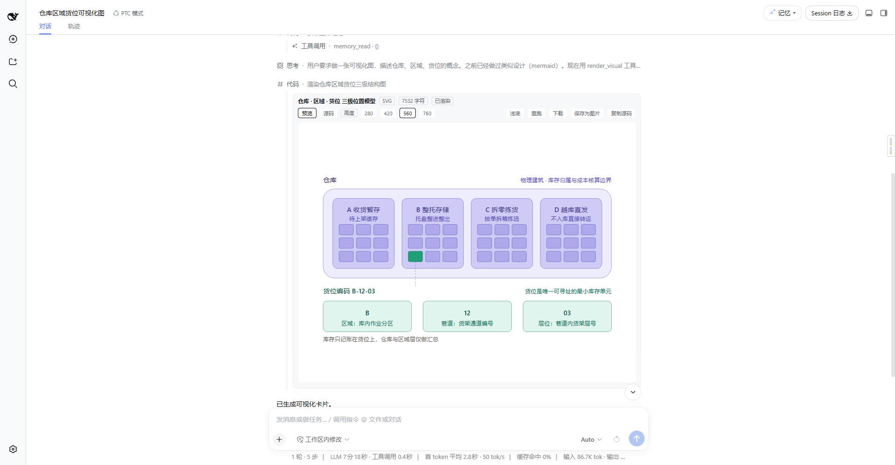

# dsh-visualizer-widget

DeepSeek Harness 的会话流「内联可视化」插件：模型产出 SVG / HTML 源码后，交给浏览器渲染成一张可交互的内联卡片，源码只进卡片、不回灌模型上下文。

[](./LICENSE) [](https://www.npmjs.com/package/dsh-visualizer-widget) [](https://github.com/deepseek-ai/deepseek-harness)

## 能做什么

插件注册两个工具：

| 工具 | 作用 |
| --- | --- |
| `render_visual` | 把 SVG / HTML 源码渲染成会话流内联卡片（预览/源码切换、高度档位、浅色/深色底、重跑、复制） |
| `get_visualizer_spec` | 按需返回统一渲染规范全文（viewBox 基准 680、字号/字重约束、9×7 色板、明暗配色、图类型路由、导出陷阱等） |

卡片在 `tool.call.toolview` 槽位上按 `render_visual` 键接管该工具的调用行，源码经 iframe `srcdoc` 沙箱隔离渲染。

## 效果预览



## 设计要点

- **源码与模型上下文解耦**：`render_visual` 的 `output.render` 只回一行摘要（格式 / 字符数 / 高度），完整源码只留在工具结果与卡片里，不进入模型上下文。
- **渲染规范随包分发**：`get_visualizer_spec` 返回的规范固化的内联可视化设计规范，生成源码时据此保持统一视觉。
- **安全隔离**：iframe 沙箱只给 `allow-scripts allow-popups allow-forms`，不带 `allow-same-origin`，卡片内脚本拿不到主页面 DOM / storage。

## 安装

```bash
# 本地目录
dsh plugin --profile web add .

# 或从 GitHub
dsh plugin --profile web add github:lovezi0/dsh-visualizer-widget
```
```bash
# 卸载
dsh plugin --profile web remove dsh-visualizer-widget
```

## 构建

```bash
npm run build
```

产物 `lib/index.js`（host 半）与 `lib/client.js`（client 半单文件 bundle）已随包提交，`github:` 安装拉到的源码自带 `lib/`，加载即用。

## 使用

让模型「画一个柱状图看板」「渲染这段 SVG 原型」时，模型会调用 `render_visual`，卡片直接出现在会话流里；生成复杂图表前可先调 `get_visualizer_spec` 核对规范。

## 版本历史

**0.1.0**
    - 🔥会话流「内联可视化」插件